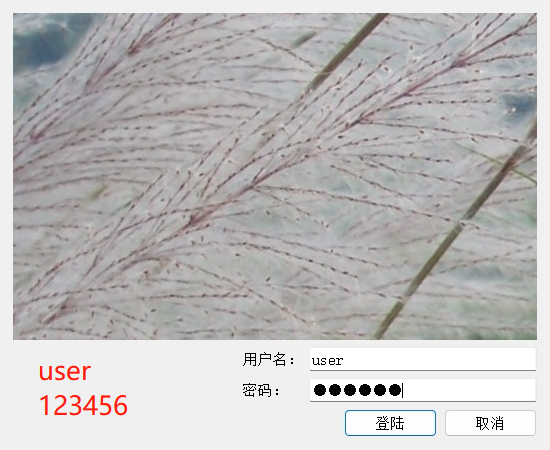

# 学生信息管理系统

该项目是一个学生信息管理系统，可以帮助学校管理学生的个人信息、年级信息、班级信息等。本项目使用Qt5 + MySQL 开发实现。

## 运行截图：

## 功能列表

- 登录功能
- 年级管理
- 班级管理
- 学生信息管理
- 学生查询

### 数据库设计

- 学生表
  - ID
  - 姓名
  - 年龄
  - 性别
  - 地址
  - 手机号
  - 年级ID
  - 班级ID
- 年级表
  - ID
  - 年级名称
- 班级表
  - ID
  - 班级名称
  - 年级ID
- 用户信息
  - 用户名
  - 用户密码(MD5加密)

### 登录功能设计

- 输入用户名和密码
- 校验用户名和密码是否正确
- 如果正确，进入主窗口；否则提示用户重新输入

### 主窗口功能设计

- 显示菜单
- 显示当前用户名和当前登录账号
- 菜单包括年级管理、班级管理、学生信息管理、学生查询、用户信息管理等功能

### 年级管理功能设计

- 显示所有年级
- 可以添加年级、删除年级、修改年级

### 班级管理功能设计

- 显示所有班级
- 可以添加班级、删除班级、修改班级

### 学生信息管理功能设计

- 显示所有学生信息
- 可以添加学生信息、删除学生信息、修改学生信息
- 添加学生信息时，需要选择年级和班级
- 当点击某一个学生信息时，可以显示该学生的全部信息

### 学生查询功能设计

- 可以按照姓名、学号等信息进行查询
- 显示查询结果
- 如果输入为空时则显示全部学生信息

## 安装和使用

1. 克隆或下载该项目的代码
2. 本项目提供Mysql提供创建数据库和添加数据库源码，存放在MySql文件夹，在运行项目前请根据.sql文件添加数据库
3. 安装依赖 本程序使用Qt自带的qmake 进行管理，请使用QtCreator进行运行。
4. 运行项目，即可使用

## 贡献者

- [ee778](https://github.com/ee778)

## 许可证

该项目使用[MIT](https://github.com/xxx/yyy/blob/main/LICENSE)许可证。

